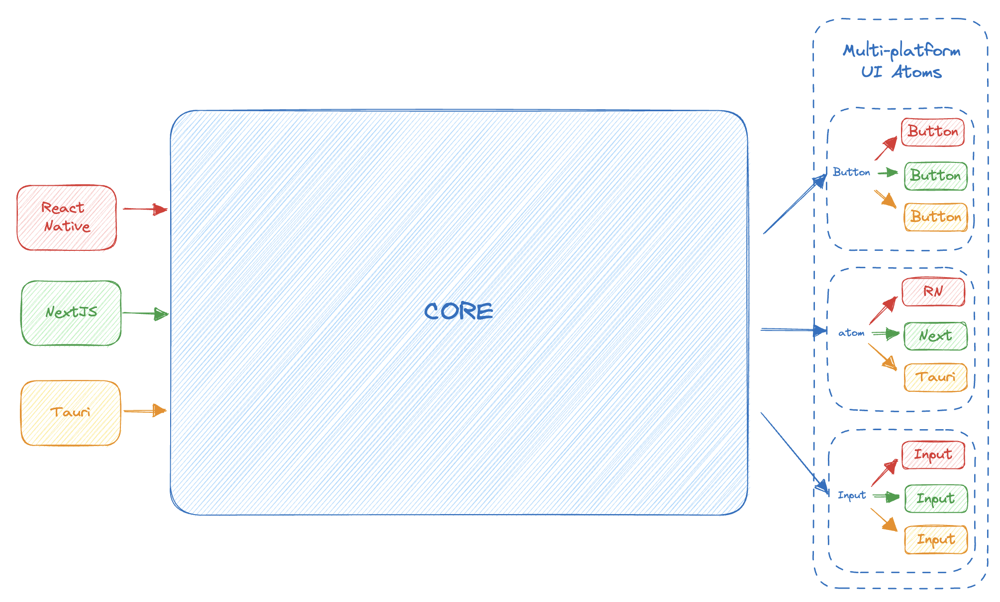
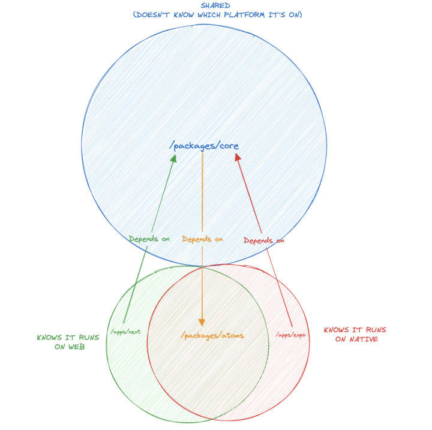

# 🌌 Enguage Universal App

  
   
   
   
  This is a Universal App to show the functionality of the <a href="https://bitbucket.org/martinwheatman/enguage/src/develop/" target="_blank">Enguage</a> Natural Language Understanding library.
   
   
  This App is also a proof of concept to demonstrate how a unified codebase can be used to distribute an application across multiple platforms - developing features once and running them on any platform.
   
   
  The particular app I used as a POC is a simple chat interface for a <a href="https://github.dev/martinwheatman/enguageMirror/tree/develop/opt/api/" target="_blank">Java API</a> I wrote to wrap the Enguage Java library.
  

## 🚀 See the app deployed

<table align="center">
  <tr display="flex">
    <th>🤖 Android: </th>
    <th>🍎 iOS: </th>
    <th>🕸️ Web: </th>
    <th>🍎 MacOS: </th>
  </tr>
    <td>
      
    </td>
    <td>
      
    </td>
    <td>
      <a href="https://enguage-universal-app-next-n61urasnk-jamesdhw.vercel.app/chat" target="_blank">NextJS app on Vercel</a>
    </td>
    <td>
      <a href="https://github.com/JamesDHW/enguage-universal-app/tree/856192d38ddc3327a6e2863678f1e5c452a13def/apps/tauri/target/release/bundle" >MacOS app</a>
    </td>
</table>

## 💡 The idea

One unified codebase with five different distributions on five different platforms. The codebase uses React + React Native to deploy via NextJS with SSR and Expo on Android and iOS.

Using a monorepo, we can split our app into clean boundaries:

- `/apps`: the entry point for each app and place where any native specific code for each app is implemented (e.g. routing, which is file-base in both in Next and Expo). Here we implement things which **must** be platform specific. _Solito_ helps with this.
- `/packages/core`: the bulk of the app sits here and it platform agnostic. React is used, but as all components are abstracted behind a package, we don't care which platform we're targeting.
- `packages/atoms`: we create an interface for cross-platform UI atoms. Here we must provide an implementation for each platform. _Tamagui_ helps with this.

## 👷 Architecture

This style of app works well in particular for apps that require parity across platforms over a large set of features (e.g. Notion/ Slack/ Zoom/ Netflix web + mobile + desktop apps).

A lot of care must be put into implementing the interface for the multi-platform UI atoms, however investing the time in ensuring platform specific UI elements well means that features can be developed across all platforms and released in parallel, rather than having a divergent codebase.

    

## 🗺️ Deciding where code belongs

    

## ✅ TODOs:

- Session management
- Voice interface
- Fix TS configs + more refactoring

## ⚠️ Quick note

I made this repo quite quickly as a POC - if I had more time I would fix some of the leaky abstractions and set up better boundaries within the code. More refactoring to clean up the repo might be incoming!

[Auto-generated Readme](./docs/README.md)
