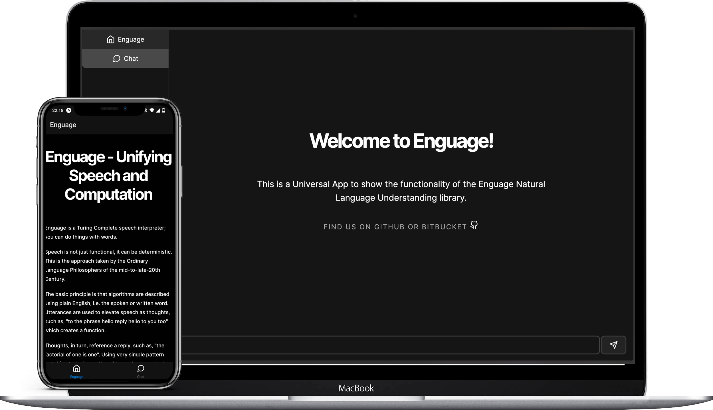

# 🌌 Enguage Universal App

  
   
   
   
  This is a Universal App to show the functionality of the <a href="https://bitbucket.org/martinwheatman/enguage/src/develop/" target="_blank">Enguage</a> Natural Language Understanding library.

## 💡 The idea

One unified codebase with three different distributions on three different platforms. The codebase uses React + React Native to deploy via NextJS with SSR and Expo on Android and iOS.

Using a monorepo, we can split our app into clean boundaries:

- `/apps`: the entry point for each app and place where routing for each app is implemented (both in Next and Expo we have file-based routing). Here we implement things which **must** be platform specific. _Solito_ helps with this.
- `/packages/core`: the bulk of the app sits here and it platform agnostic. React is used, but as all components are abstracted behind a package, we don't care which platform we're targeting.
- `packages/atoms`: we create an interface for cross-platform UI atoms. Here we must provide an implementation for each platform. _Tamagui_ helps with this.

The app is a simple chat interface for a [Java API](https://github.dev/martinwheatman/enguageMirror/tree/develop/opt/api) I wrote which wraps the Java library Enguage.

## 🚀 See the app deployed

<table align="center">
  <tr display="flex">
    <th>🤖 Android: </th>
    <th>🍎 iOS: </th>
    <th>🕸️ Web: </th>
  </tr>
    <td>
      
    </td>
    <td>
      
    </td>
    <td>
      <a href="https://enguage-universal-app-next-n61urasnk-jamesdhw.vercel.app/chat" target="_blank">NextJS app on Vercel</a>
    </td>
</table>

## ✅ TODOs:

- Session management
- Voice interface
- Fix TS configs + more refactoring

## ⚠️ Quick note

I made this repo quite quickly as a POC - if I had more time I would fix some of the leaky abstractions and set up better boundaries within the code. More refactoring to clean up the repo might be incoming!

[Auto-generated Readme](./docs/README.md)
